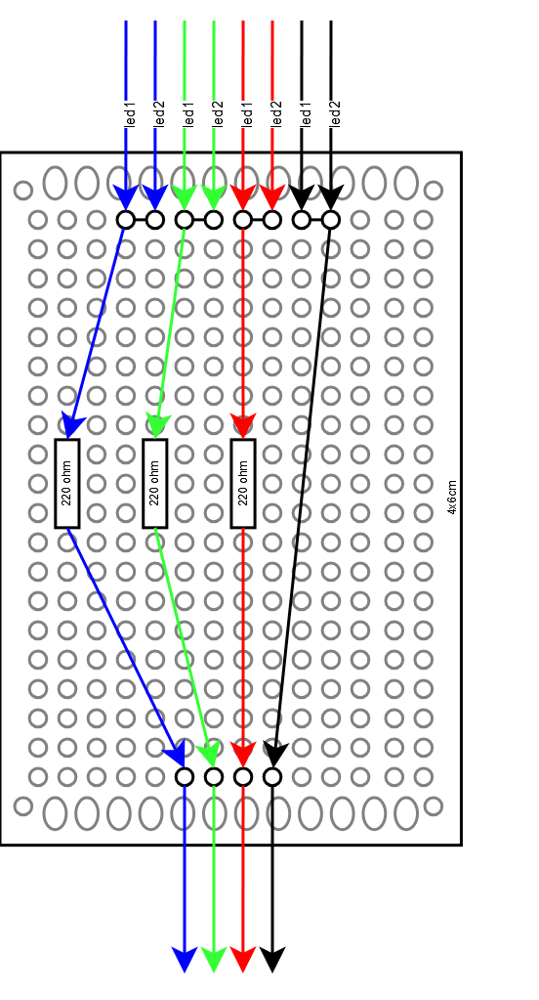

# led_api

This contains the Python scripts for the LED API.

> NOTE: As of 02/24/2026, the API has not yet been created. Currently, there are only things that relate to the physical prototype board. These include:
>
> - A pinout of the prototype board
> - A simple test file that cycles through the possible colors/states.

<p align="center">
  
</p>

## Running Test Program

1. Connect the LEDs to prototype board using female-to-female jumper cables
2. Connect the prototype board to the Raspberry Pi according to the overall pinout (located in the architecture) <!-- TODO: Maybe add the pinout PNGs to the repo? -->
3. Set up the RPi if not done already
4. Run the following commands:

```bash
cd ~/develop/KU-Capstone-2026/rpi/src/led_api
python led_test.py
```
